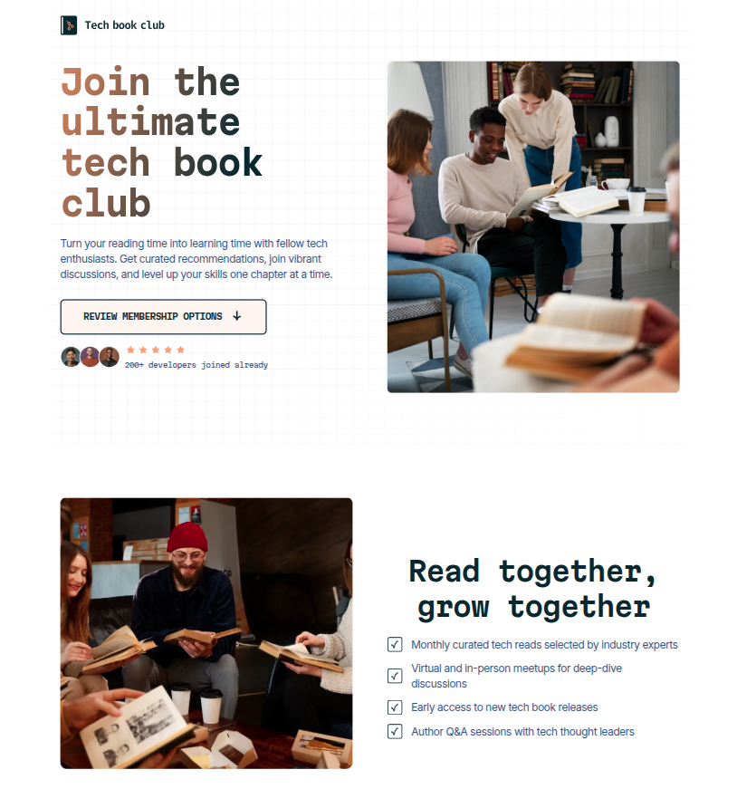
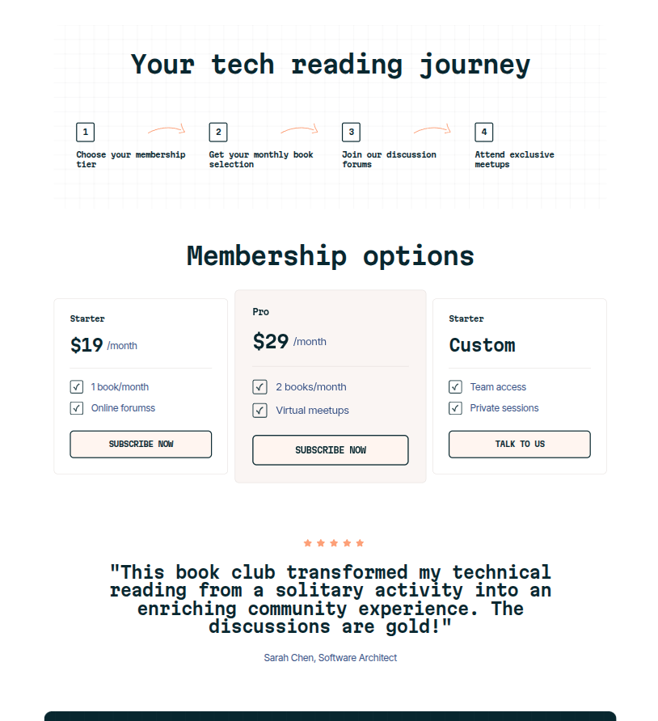
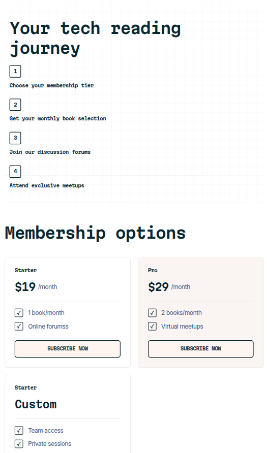
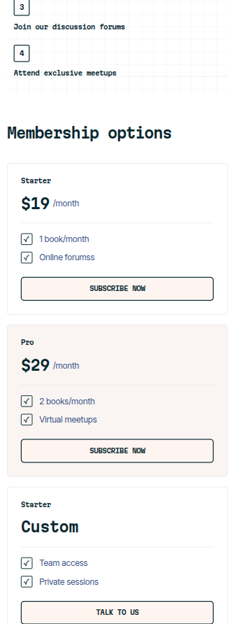

# Tech book club landing page

This is my second fully responsive landing page! Feel free to give me a star 😄
 
It features a complete book club landing page using only HTML and CSS.
 
I was able to use Google Fonts @import statement to implement a non-default font-family, variables, grid, flexbox, picture/src-set for loading images accordingly to screen size, B.E.M architecture, pseudo attributes, different selectors (:nth-child, :not).
 
Developed from zero from a Figma Design reference.

---

## Preview

### Desktop

### Tablet

### Mobile

## 
## 

---

## How to use and customize

1. Clone the repo

`git clone https://github.com/rodrigodvalente/book-club-landing-page.git`

2. Navigate to the directory

`cd book-club-landing-page`

3. Open the `index.html` and customize in your code editor of preference

---

## 🧠 Best practices

It features **variables**, **BEM**, **focus**, **GRID**, **flexbox**, **google fonts**,**picture/srcset**, **psudo-elements**, **nth-child selectors**

I also used Prettier to make the layout better on **VSCode** and used the command line for versioning with Git.
